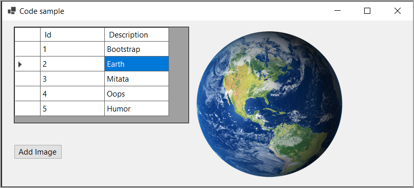

# About

Shows how to data from a SQL-Server database table with image as **varbinary(MAX)** into a DataGridView and PictureBox.

Created with Microsoft Visual Studio 2022, .NET Core 7

## Important

To try this out first run the script to create the database under DataScripts folder.

## Information

In the screenshot below the Id is only shown for this code sample. We can get at the Id in code by casting the BindingSource.Current property to a DataRow and access any property including the Id property.

The DataGridView columns are setup in the designer, not via code.

The PictureBox is set to AutoSize.

## NuGet packages

- [ConfigurationLibrary](https://www.nuget.org/packages/ConfigurationLibrary/1.0.1?_src=template) This library provides a method to obtain a connection string from appsettings.json to use with a data provider or Entity Framework Core, intended for desktop applications as ASP.NET Core has this already with more options via dependency injection.
- [Microsoft.Data.SqlClient](https://www.nuget.org/packages/Microsoft.Data.SqlClient/5.1.1?_src=template) Provides the data provider for SQL Server. These classes provide access to versions of SQL Server and encapsulate database-specific protocols, including tabular data stream (TDS)

