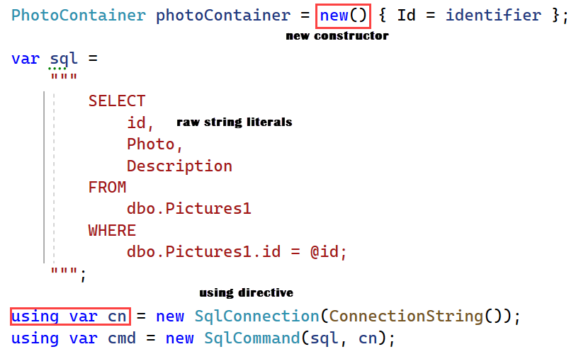
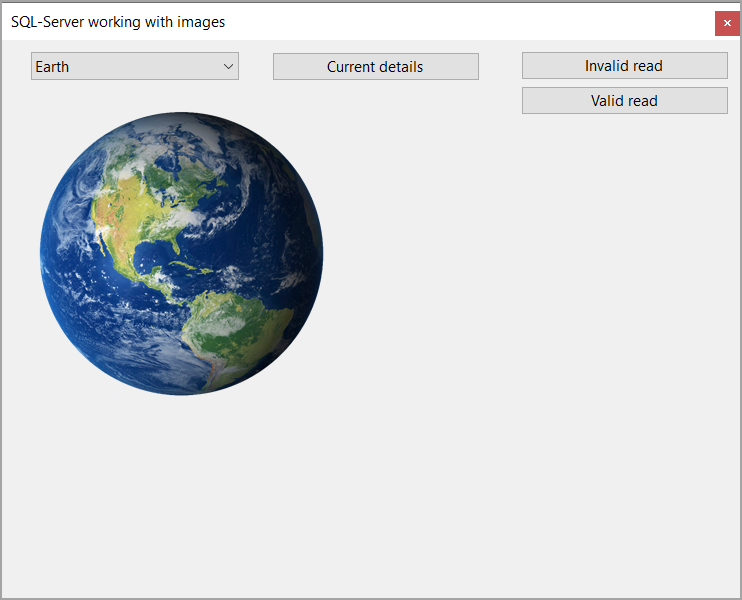

## Introduction

Learn how to store images in a SQL-Server database table where the image size is no greater than 256k and 1M as the rule of thumb is for images over 1M it is best to store those images in the file system. Another piece of advice, separate images from factual information e.g. an employee table should not contain the employee image, instead store the image in an image table which relates back to the employee table.

## Requires

Microsoft Visual Studio 2022 or greater, for Visual Studio 2022 edition needs to be 17.4.x as code provided uses various new features of .NET Core 7.




## Recommendations

Use [SSMS](https://learn.microsoft.com/en-us/sql/ssms/download-sql-server-management-studio-ssms?view=sql-server-ver16) for working with SQL-Server outside of Visual Studio while Visual Studio provides tools needed, SSMS is easier.

## Data type for images

Many developers use **image** which works but Microsoft has indicated that future versions of SQL-Server will be removing **image** type, see [Microsoft docs](https://learn.microsoft.com/en-us/sql/t-sql/data-types/ntext-text-and-image-transact-sql?redirectedfrom=MSDN&view=sql-server-ver16). For this reason, what follows will use [varbinary(MAX)](https://learn.microsoft.com/en-us/sql/t-sql/data-types/binary-and-varbinary-transact-sql?view=sql-server-ver16).

## Overview of code sample

Code presented is in a conventional Windows Forms, .NET Core 7 with the location of images below the application folder. 

Why not use a dialog to get the image files? Any developer with a little knowledge of working with Windows Forms should know how to use a dialog to collect files and introducing a dialog clouds the intent to work with images.

### Classes

- FileOperations, a simple class with one method, get the image files to insert into a table.
- PhotoOperations
    - **InsertImage** method to insert a new record
    - **ReadImage** read record by primary key
    - **Read** read all records
    - **TruncateTable** for resetting the table

### Form operations

In form shown event
- Reset the table for storing images
- Get image files from disk
- Insert images from above into the database table
- Immediately read images back into a list
- Assign the list to a ComboBox
- Setup the SelectedIndexChanged event for the ComboBox for displaying the current image in a PictureBox

### Read back a single image

There are two buttons, one attempts to read an non-existing image while the other reads back an existing image.

Why show attempting to read a non-existing image? Simply because it's a best practice to use assertion as what might happening during the course of running an application an external entity remove the record? Best to be pro-active.

```csharp
public static (PhotoContainer, bool) ReadImage(int identifier)
{
    PhotoContainer photoContainer = new() { Id = identifier };

    var sql = 
        """
            SELECT 
                id, 
                Photo,
                Description
            FROM 
                dbo.Pictures1 
            WHERE 
                dbo.Pictures1.id = @id;
        """;

    using var cn = new SqlConnection(ConnectionString());
    using var cmd = new SqlCommand(sql, cn);

    cmd.Parameters.Add("@Id", SqlDbType.Int).Value = identifier;
    
    cn.Open();

    var reader = cmd.ExecuteReader();

    if (reader.HasRows)
    {
        reader.Read();

        photoContainer.Description = reader.GetString(2);
        var imageData = (byte[])reader[1];
        using (var ms = new MemoryStream(imageData, 0, imageData.Length))
        {
            ms.Write(imageData, 0, imageData.Length);
            photoContainer.Picture = Image.FromStream(ms, true);
        }

        return (photoContainer, true);
    }
    else
    {
        return (photoContainer, false);
    }
    
}
```

## Code to insert an image

Note the return value **return cmd.ExecuteNonQuery();** is not used here but in a production application one should check that 1 is returned and even add a try-catch in the event of failure e.g. insufficient permissions, database offline etc. 

```csharp
public static int InsertImage(byte[] imageBytes, string description)
{
    var sql = 
        """
            INSERT INTO [dbo].[Pictures1] 
                (
                    [Photo], 
                    Description
                ) 
            VALUES 
            (
                @ByteArray, 
                @Description
            )
        """;

    using var cn = new SqlConnection(ConnectionString());
    using var cmd = new SqlCommand(sql, cn);
    
    cmd.Parameters.Add("@ByteArray", SqlDbType.VarBinary).Value = imageBytes;
    cmd.Parameters.Add("@Description", SqlDbType.NVarChar).Value = description;

    cn.Open();

    return cmd.ExecuteNonQuery();
```


## DataTable container

Typically a novice developer gravitates to a DataTable as it is easy but these containers are overkill so in the code provided a class/model is used.

```csharp
public class PhotoContainer
{
    public int Id { get; set; }
    public Image Picture { get; set; }
    public string Description { get; set; }
    public override string ToString() => Description;
}
```
> **Note**
> By overriding ToString this will be used for DisplayMember of the ComboBox.

## Preparation to run the code

Using SSMS create a new database named WorkingImages, run the following in a new query window.

```sql
USE [WorkingImages]
GO
/****** Object:  Table [dbo].[Pictures1]    Script Date: 4/16/2023 10:13:48 AM ******/
SET ANSI_NULLS ON
GO
SET QUOTED_IDENTIFIER ON
GO
CREATE TABLE [dbo].[Pictures1](
	[Id] [int] IDENTITY(1,1) NOT NULL,
	[Photo] [varbinary](max) NULL,
	[Description] [nvarchar](max) NULL,
 CONSTRAINT [PK_Pictures1] PRIMARY KEY CLUSTERED 
(
	[Id] ASC
)WITH (PAD_INDEX = OFF, STATISTICS_NORECOMPUTE = OFF, IGNORE_DUP_KEY = OFF, ALLOW_ROW_LOCKS = ON, ALLOW_PAGE_LOCKS = ON, OPTIMIZE_FOR_SEQUENTIAL_KEY = OFF) ON [PRIMARY]
) ON [PRIMARY] TEXTIMAGE_ON [PRIMARY]
GO
```

The above query is also stored in the project under DataScripts folder.

Open the solution in Microsoft Visual Studio 2022 with edition 17.4.x which is required for some of the newer features like raw string literals.

Build the project followed by running the project. On an average machine the insert of images, reading back images and displaying the form will be less than one second.

Expected when the form is displayed.


## NuGet packages

- [ConfigurationLibrary](https://www.nuget.org/packages/ConfigurationLibrary/1.0.1?_src=template) This library provides a method to obtain a connection string from appsettings.json to use with a data provider or Entity Framework Core, intended for desktop applications as ASP.NET Core has this already with more options via dependency injection.
- [Microsoft.Data.SqlClient](https://www.nuget.org/packages/Microsoft.Data.SqlClient/5.1.1?_src=template) Provides the data provider for SQL Server. These classes provide access to versions of SQL Server and encapsulate database-specific protocols, including tabular data stream (TDS)


 


